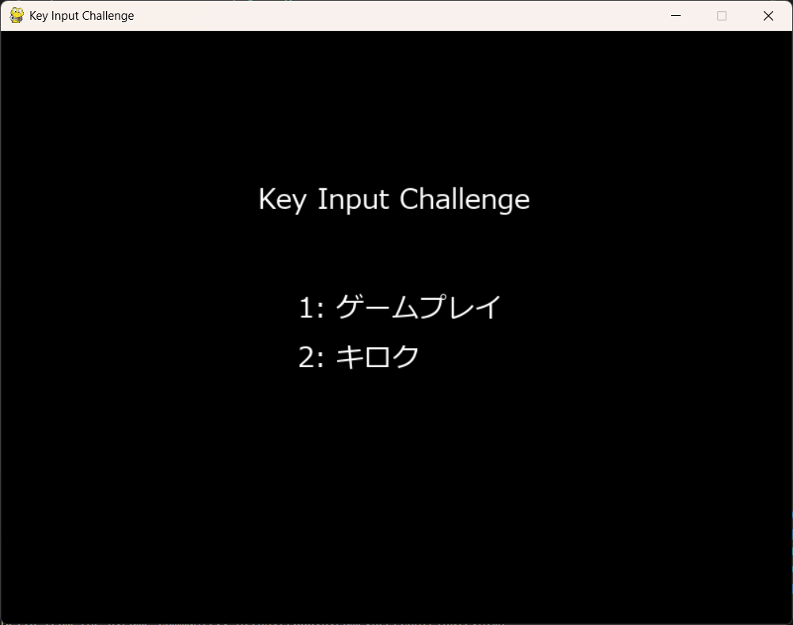
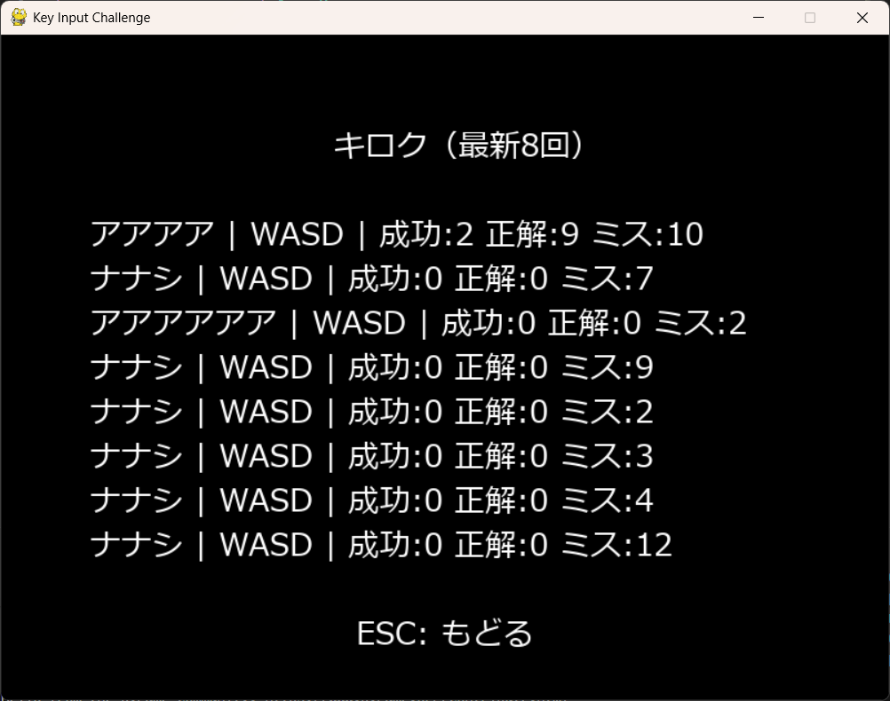
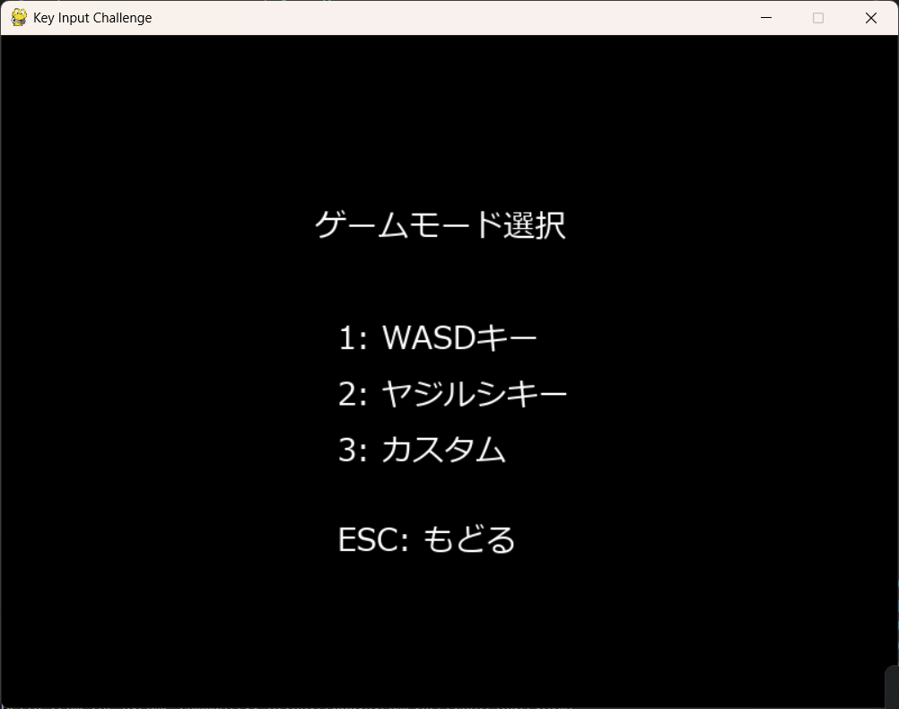
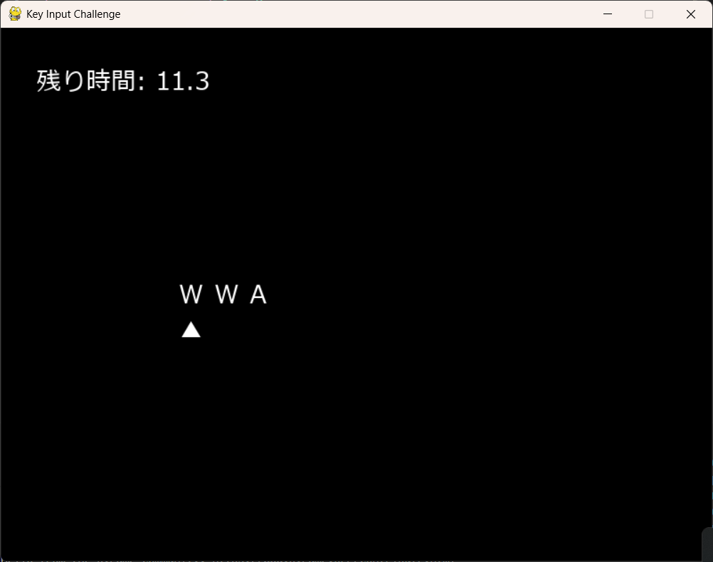
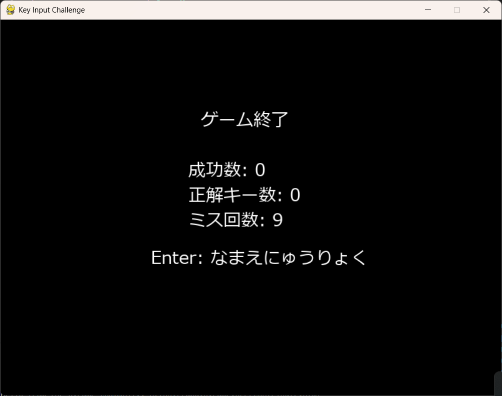

# Key Input Challenge

制作時期：2026年1月  

## 概要

Key Input Challenge は、制限時間内に表示されるキー配列をどれだけ正確に入力できるかを競う、一人用のキー入力アクションゲームです。画面上に表示された複数のキーを左から順に入力していき、すべて正しく入力できれば成功数が加算され、制限時間が延長されます。一方で、入力を間違えると制限時間が減少し、新しい問題に切り替わります。

本作では単純な反射神経だけでなく、視認性や集中力、キー配置への慣れが重要となるよう設計されています。成功数が一定に達するごとに入力すべきキーの数が増えたり、新しいキーが追加されたりするため、プレイが進むにつれて難易度が段階的に上昇していきます。

ゲームモードは「WASDキー」「ヤジルシキー」「カスタム」の3種類を用意しました。特にカスタムモードでは、初期キー数や使用するキー、難易度の上昇条件、制限時間などを自由に設定することができ、自分好みのチャレンジを作成できます。

ゲーム終了後には名前を入力して記録を保存することができ、入力はカタカナのみに制限されています。未入力の場合は「ナナシ」として記録されます。本作は Python と pygame を用いて制作されており、シーン管理やゲームロジックをクラス分割することで、拡張や改修がしやすい構成を意識しました。

## 起動方法

```bash
pip install -r requirements.txt
python src/main.py

## スクリーンショット

### メニュー画面


### キロク画面


### ゲームモード画面


### ゲームプレイ画面


### リザルト画面
